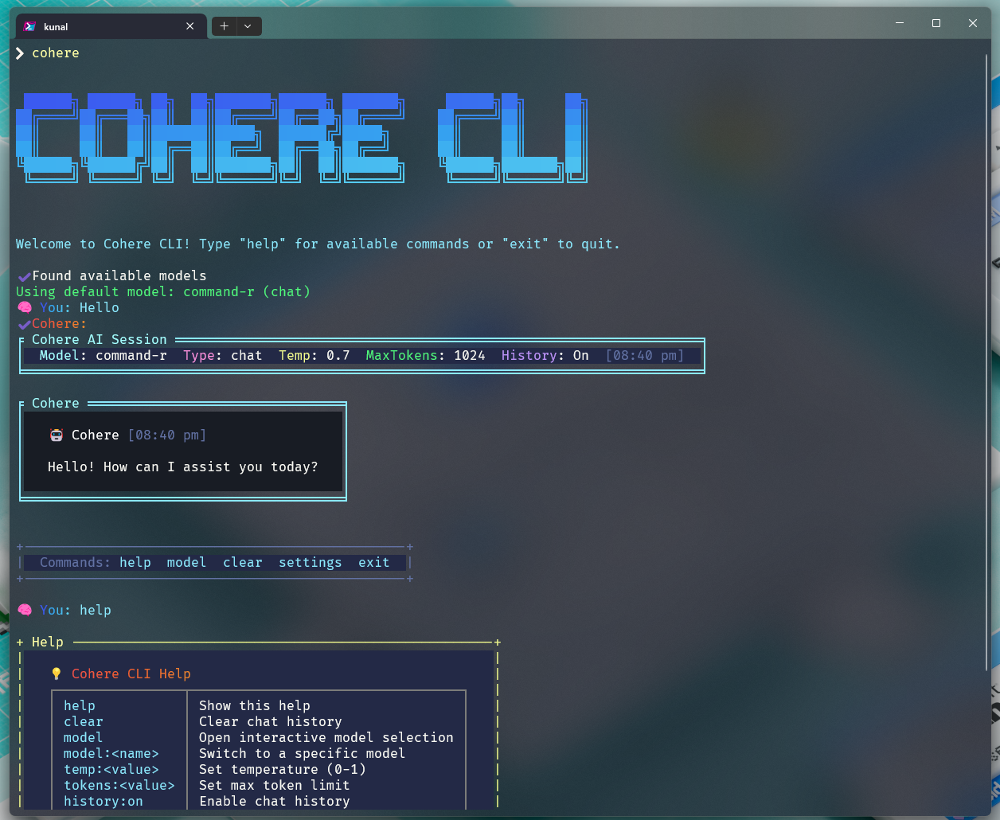

# Cohere CLI

A beautiful, professional, and feature-rich command-line interface for chatting with Cohere AI models.



## Features

- 🌈 Stunning UI: Gradient text, ASCII art, boxed responses, and colorful tables
- ⚡ Direct API integration: Uses fetch with Cohere endpoints
- 🤖 Supports both chat and generate APIs, with dynamic model selection
- 🔄 Interactive model menu and direct model switching (`model` and `model:<id>`)
- 📊 Token usage and session statistics
- 📋 Markdown rendering, code highlighting, and citation tables
- ⚙️ Adjustable parameters: temperature, max tokens, session settings
- 💬 Chat history management (`history:on/off`, `clear`)
- 📝 Create files from detected code blocks in responses
- 🛠️ CommonJS compatible (Node.js v14+), global install support


## Installation

Install globally via npm:

```sh
npm i -g cohere-cli
```

You can now run the CLI anywhere using:

```sh
cohere
```

Set your Cohere API key as an environment variable (example for Windows PowerShell):

```powershell
$env:COHERE_API_KEY = "your_api_key_here"
```


### Command-line Options
---


- `-k, --api-key <key>`   Cohere API key (overrides env variable)
- `-m, --model <model>`   Specify model to use
- `-t, --temperature <temp>` Set temperature (0-1)
- `-s, --single-message`   Send a single message and exit
- `--no-history`        Don't include chat history in requests
- `--max-tokens <number>`  Maximum tokens for response

### In-CLI Commands
---

- `help`     Show available commands
- `clear`     Clear chat history
- `model`     Interactive model selection
- `model:<id>`  Switch to a specific model
- `temp:<value>` Set temperature (0-1)
- `tokens:<value>` Set max token limit
- `history:on/off` Enable/disable chat history
- `settings`   Show current settings
- `exit`     Exit the CLI

### File Creation from Code Blocks
---

If the Cohere response contains code blocks, the CLI will prompt you to create files from them. You can confirm, edit filenames, and the files will be saved in your working directory.

### Getting a Cohere API Key
---

Visit [https://dashboard.cohere.ai/api-keys](https://dashboard.cohere.ai/api-keys) to get your API key.

## Compatibility

- Node.js v14 or higher
- CommonJS modules (not ESM)
- Tested on Windows

## License

MIT
